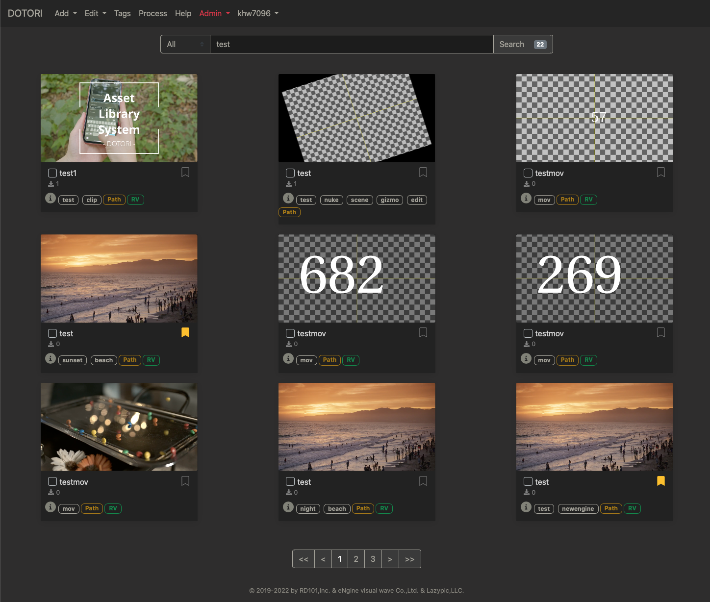

# DOTORI(가제)

[](https://goreportcard.com/report/github.com/rd101/dotori)

VFX, 애니메이션, 게임, 사운드 등 콘텐츠 제작에 사용되는 에셋 관리 솔루션

#### Screenshot


#### Demo
[](http://www.youtube.com/watch?v=VNBdlPDKzTc "Asset Library System - DOTORI")

### 기본정보
- 개발기간: 2019.9 ~ 現
- 개발방법: 오픈소스 공동개발 프로젝트
- 개발형태 : Web Application Server
- 개발도구: Go, mongoDB, Javascript, HTML, CSS
- 개발지원: [(주)로드원오원](http://rd101.co.kr), [(주)엔진비주얼웨이브](http://www.enginevw.co.kr), [Lazypic,LLC.](https://lazypic.org)
- 권리자(발명자): [Contributors](https://github.com/RD101/dotori/graphs/contributors)
- 테스트서버: https://dotori.lazypic.com
- [다운로드](https://github.com/RD101/dotori/releases)

## 특 징
- 검색엔진 인터페이스
- 태그 시스템
- 에셋 Attribute 설정
- REST API 지원
- 멀티 스레딩 에셋 연산 및 연산 상태 모니터링
- 관리자 페이지를 통해 회사 상황에 맞는 환경 셋팅
- OS 의존성 최소화
- 유연한 에셋 포멧 확장
- 내부 인트라넷 서버구축
- DB 관리모드 지원
- OpenColorIO, OpenImageIO, FFmpeg 오픈소스를 통한 연산
- 유저관리

## 사용 방법

### 서버 권장 사항
- OS: Linux, macOS 또는 Windows Server
- 메모리: 32기가 이상

### yum명령어 최신으로 업데이트
Dafault로 설치되어 있는 yum으로는 필요한 라이브러리를 설치할 수 없습니다.
아래 명령어를 통해 업데이트 해주세요.

 ```
 # yum install epel-release
 ```

### DB 설치 및 실행
도토리는 mongoDB를 사용하고 있습니다. mongoDB를 설치해주세요.
- [mongoDB 설치하는 법](https://github.com/cgiseminar/curriculum/blob/master/docs/install_mongodb.md)

### 기타 라이브러리 및 명령어 설치
도토리에서 사용하고 있는 라이브러리의 설치와 설정방법은 아래 문서를 참고해주세요.
- [Library 설치 및 설정](documents/setlibrary.md)

도토리에서 사용중인 라이브러리는 다음과 같습니다.
- OpenColorIO
- OpenImageIO 2.x 이상
- FFmpeg

### 인증서 발급
https 보안프로토콜을 사용하기 위해서는 인증서를 발급받아야 합니다. 아래 문서를 참고해주세요.
- [인증서 만드는 방법](documents/how_to_make_certification.md)

### 웹서버 실행
준비가 되었다면 아래 명령어를 통해 웹서버를 실행시켜 주세요.
```bash
$ sudo dotori -http :80
```
> 여러분이 macOS를 사용한다면 기본적으로 80포트는 아파치 서버가 사용중일 수 있습니다. `:80` 포트에 실행되는 아파치 서버를 종료하기 위해서 $ sudo apachectl stop 를 터미널에 입력해주세요.

### CentOS 방화벽 설정
다른 컴퓨터에서의 접근을 허용하기 위해서 해당 포트에 대한 방화벽을 해제합니다.
 ```
# firewall-cmd --zone=public --add-port=80/tcp --permanent
# firewall-cmd --reload
```

### 백업
회사의 무형 자산을 안전하게 지키기 위해서는 정기적인 백업이 중요합니다.
mongoDB를 백업하는 방법은 아래 문서를 참고해 주세요.
- [backup](documents/backup.md)

## 개발자 API
도토리는 `웹`, `command line`, `REST API`를 이용해서 조작할 수 있습니다.

### Command-line
command를 통해 dotori를 제어할 수 있습니다.
- [Item](documents/command_item.md)
- [User](documents/command_user.md)

### REST API
Dotori는 REST API를 지원합니다. Python, Go, Java, Javascript, node.JS, C++, C, C# 등 수많은 언어를 통해 Dotori를 이용할 수 있습니다.
아래는 Dotori의  REST API reference 문서입니다.
- [item](documents/restapi_item.md)
- [item](documents/restapi_user.md)
- [admin setting](documents/restapi_adminsetting.md)

## 개발에 기여하고 싶다면...
도토리는 오픈소스로 진행 중인 프로젝트입니다. 개발에 기여하고 싶다면 아래 내용을 참고해주세요!

### 개발환경셋팅
Go에서 컴파일된 파일이 생성되는 경로를 설정하기 위해 GOBIN 환경변수 셋팅이 필요합니다.

리눅스라면 .bashrc에 선언해주세요.
macOS이고 zsh쉘을 사용한다면 `.zshenv` 에 bash쉘을 사용한다면 `.bashrc`에 아래 설정을 추가해주세요.

```bash
export GOBIN=$HOME/bin
export PATH=$PATH:$GOBIN
```

dotori는 sudo로 실행해야 합니다. 그러나 linux의 경우, sudo가 현재 계정의 PATH를 다 가져오지 못하는 경우가 있습니다. 그럴 때는 /etc/visudoers 파일을 아래처럼 변경해주세요.

```bash
$ sudo visudo
...

#Default secure_path="/usr/local/sbin:/usr/local/bin:/usr/bin" # 기존 부분 주석 처리
Default env_keep=PATH # 새로 추가
```

### 예제파일 안내
에셋 라이브러리 개발에 사용된 예제 파일에 대한 안내 문서입니다.
- 작은용량의 예제 파일들은 `examples` 폴더에 들어있습니다.
- 용량이 큰 파일은 가벼운 리포지터리 관리를 위해 TD교육에 사용된 예제파일 리포지터리에 저장되어있습니다.
- Footage 데이터
    - footage 데이터는 95메가 정도의 용량을 가지고 있습니다.
    - 리포지터리에는 최대한 가벼운 파일, 코드만 올리기 위해 위 폴더에 footage 데이터는 들어가 있지 않습니다.
    - footage 예제파일은 https://github.com/lazypic/tdcourse_examples/tree/master/footage 에서 다운받을 수 있습니다.
- HDRI 데이터
    - HDRI 데이터는 55메가 정도의 용량을 가지고 있습니다.
    - 리포지터리에는 최대한 가벼운 파일, 코드만 올리기 위해 위 폴더에 HDRI 데이터는 들어가 있지 않습니다.
    - HDRI 예제파일은 https://github.com/lazypic/tdcourse_examples/tree/master/hdri 에서 다운받을 수 있습니다.
- Mov 데이터
    - Prores422HQ 코덱의 mov 데이터는 2초에 43메가 정도의 용량을 가지고 있습니다.
    - 리포지터리에는 최대한 가벼운 파일, 코드만 올리기 위해 위 폴더에 Prores422HQ mov 데이터는 들어가 있지 않습니다.
    - HDRI 예제파일은 https://github.com/lazypic/tdcourse_examples/tree/master/movs 에서 다운받을 수 있습니다.

### 위키 및 개발시 주의사항
- 상단의 [wiki](https://github.com/RD101/dotori/wiki) 탭을 통해서 개발에 필요한 정보를 접근할 수 있습니다.
- 프로젝트의 전반적인 규칙, 공유되어야 할 내용이 적혀있습니다.
- 회사 특이사항 및 관련된 코드를 내부에 하드코딩하지 말아주세요.

### License
[BSD-3-Clause License](https://github.com/RD101/dotori/blob/master/LICENSE)
