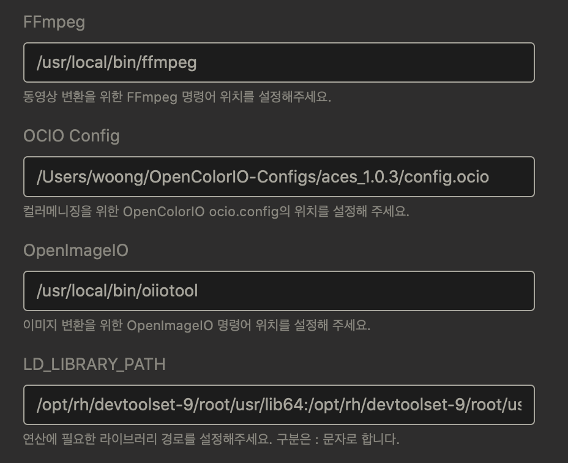

# Library Setting

## macOS
brew가 필요합니다. brew를 먼저 설치해주세요.

#### FFmpeg
동영상을 변환하기 위해서 FFmpeg를 설치합니다.

```bash
$ brew install ffmpeg
```

#### OpenColorIO-Configs 설치
원하는 컬러스페이스로 이미지의 컬러스페이스를 변환하기 위해서 OpenColorIO-Configs를 설치합니다.

```bash
$ cd ~
$ git clone https://github.com/colour-science/OpenColorIO-Configs
```

#### OpenImageIO
이미지를 컨버팅하기 위해서 OpenImageIO를 설치합니다.

```bash
$ brew install openimageio
```

## CentOS 7.9
CentOS 7.9 환경에서 에셋라이브러리 솔루션에 필요한 라이브러리 설치를 다루는 문서입니다.

#### FFmpeg
도토리는 동영상을 변환을 위해 FFmpeg를 사용하고 있습니다. 아래 방법으로 FFmpeg를 설치합니다.
```bash
$ cd ~
$ mkdir -p app/ffmpeg
$ cd app/ffmpeg/
$ wget http://johnvansickle.com/ffmpeg/builds/ffmpeg-git-amd64-static.tar.xz
$ tar xpvf ffmpeg-git-amd64-static.tar.xz --strip 1
```

#### OpenColorIO-Configs 설치
이미지 연산시 사용자가 원하는 컬러스페이스로 이미지의 컬러스페이스 변환을 위해 OpenColorIO-Configs를 설치합니다.
```bash
$ cd ~
$ sudo yum install git # CentOS를 최초 설치하면 Git이 설치되어있지 않습니다. 설치합니다.
$ git clone https://github.com/imageworks/OpenColorIO-Configs
```

#### OpenImageIO 설치
에셋 라이브러리 솔루션을 운용하기 위해서는 OpenImageIO 2.x 이상의 버전을 권장합니다.
`yum` 을 통해 설치되는 OpenImageIO는 버전이 낮기 때문에 많은 기능이 작동되지 않습니다. 예를 들어 솔루션 사용자들이 최신 버전의 .exr 포멧을 업로드할 때 이미지를 인식하지 못할 수 도 있습니다. 이러한 소소한 문제점을 해결하기 위해서 높은 버전의 OpenImageIO를 직접 컴파일해서 사용하는 것을 추천합니다.
아래 방법은 [VFX Reference Plateform 2021](https://vfxplatform.com) 규약에 맞추어서 OpenImageIO 를 설치하는 법을 다룹니다.
최종적으로 OpenImageIO를 컴파일 하기 위해서 필요한 컴파일러(GCC9), 컴파일 유틸리티(Cmake), C++의 확장 라이브러리(Boost), 그리고 그 라이브러리를 사용해서 제작된 라이브러리(openEXR, OpecolorIO-Core, OpenImageIO, LibTiff, LibPNG...)등을 순서대로 설치하는 법을 설명하겠습니다.

1. [DevToolset-9, Cmake 설치](https://github.com/lazypic/tdcourse/blob/master/docs/cmake.md)
1. [Boost 컴파일](https://github.com/lazypic/tdcourse/blob/master/docs/boost.md)
1. [OpenColorIO-Core 설치](https://github.com/lazypic/tdcourse/blob/master/docs/openimageio.md#opencolorio-core-설치)
1. [OpenEXR 컴파일](https://github.com/lazypic/tdcourse/blob/master/docs/openexr.md#openexr-컴파일하기)
1. [OpenImageIO 컴파일](https://github.com/lazypic/tdcourse/blob/master/docs/openimageio.md#openimageio-컴파일)

## Admin 셋팅 설정하기
상단메뉴 Admin > Admin Setting 설정창에 위에서 컴파일된 실행파일들의 위치를 설정해줍니다.



- FFmpeg: FFmpeg가 설치된 경로를 입력합니다.
- OCIO Config: OpenColorIO Config 경로를 입력합니다.
- OpenImageIO: OpenImageIO 명령어 위치를 설정합니다.
- LD_LIBRARY_PATH 값에는 아래 값을 설정해주었습니다. devtoolset-9에 쓰이는 라이브러리, 이미지 Read, Write 시 사용되는 라이브러리 경로를 설정해줍니다.

```
/opt/rh/devtoolset-9/root/usr/lib64:/opt/rh/devtoolset-9/root/usr/lib:/opt/rh/devtoolset-9/root/usr/lib64/dyninst:/opt/rh/devtoolset-9/root/usr/lib/dyninst:/opt/rh/devtoolset-9/root/usr/lib64:/opt/rh/devtoolset-9/root/usr/lib:/home/dotori/app/openexr-2.5.7/lib:/home/dotori/app/IlmBase:/home/dotori/app/OpenImageIO_src/src/build-scripts/ext/dist/lib:/home/dotori/app/OpenImageIO_src/src/build-scripts/ext/dist/lib:/home/dotori/app/OpenImageIO/lib64:/home/dotori/app/OpenImageIO/lib64:/home/dotori/app/OpenImageIO_src/src/build-scripts/ext/dist/lib64
```